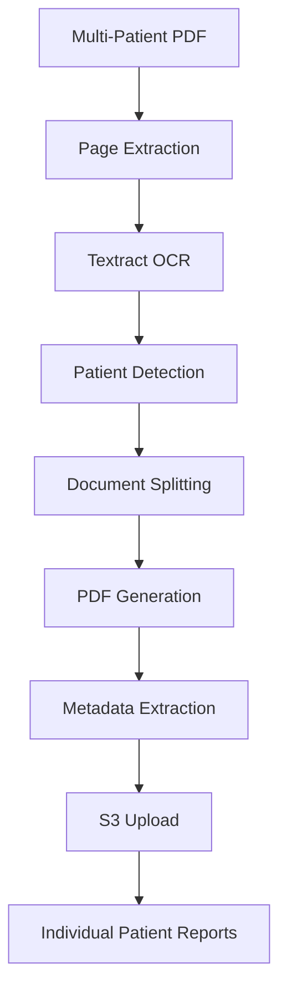

# 🏥 Medical Report Processor

[](https://nodejs.org/)
[](https://aws.amazon.com/)
[](LICENSE)

A modern, object-oriented medical document processing system that automatically splits multi-patient faxed lab reports using AWS Textract OCR and uploads individual patient reports to S3 with extracted metadata.

## ✨ Features

- 🔍 **AWS Textract OCR Integration** - Professional-grade document text extraction
- 📄 **Smart Document Splitting** - Automatically separates multi-patient fax documents
- 🏷️ **Metadata Extraction** - Extracts patient name, DOB, patient ID, and other key information
- ☁️ **S3 Storage** - Automated upload with rich metadata tagging
- 🏗️ **Modular Architecture** - Clean, testable, and extensible design
- 📊 **Form & Table Processing** - Handles structured medical forms and data tables
- 🎯 **High Accuracy** - Confidence scoring and validation for reliable results
- 🧪 **Comprehensive Testing** - Built-in test suite for document splitting logic

## 🚀 Quick Start

### Prerequisites

- Node.js 14+
- AWS Account with Textract and S3 access
- AWS credentials configured (CLI, environment variables, or IAM role)

### Installation

1. **Clone the repository:**
   ```bash
   git clone https://github.com/yourusername/medical-report-processor.git
   cd medical-report-processor
   ```

2. **Install dependencies:**
   ```bash
   npm install
   ```

3. **Configure environment variables:**
   ```bash
   cp .env.example .env
   # Edit .env with your AWS credentials and settings
   ```

4. **Test the installation:**
   ```bash
   npm test
   ```

### Basic Usage

```bash
# Process the included sample file
npm start

# Process your own file
npm start path/to/your/faxed-reports.pdf

# Show help and options
npm start -- --help
```

## 📖 Documentation

### Environment Configuration

Create a `.env` file with the following variables:

```env
# AWS Configuration
AWS_REGION=us-east-1
S3_BUCKET_NAME=your-reports-bucket
AWS_ACCESS_KEY_ID=your-access-key
AWS_SECRET_ACCESS_KEY=your-secret-key

# Processing Options (Optional)
TEXTRACT_CONFIDENCE_THRESHOLD=80
MAX_PAGES_PER_PATIENT=10
```

### Programmatic Usage

#### Simple Usage
```javascript
import { createReportProcessor } from './src/index.js';

const processor = createReportProcessor({
  aws: {
    region: "us-east-1",
    s3BucketName: "my-reports-bucket"
  }
});

const results = await processor.processReport("lab-reports.pdf");
```

#### Using Individual Components
```javascript
import {
  TextractService,
  PDFProcessor,
  MetadataExtractor
} from './src/index.js';

const config = new Config();
const textract = new TextractService(config);
const pdf = new PDFProcessor(config);
const extractor = new MetadataExtractor(config);

// Process individual pages
const pdfDoc = await pdf.loadPDF("document.pdf");
const pageBytes = await pdf.extractPageBytes(pdfDoc, 0);
const data = await textract.extractData(pageBytes);
const metadata = extractor.extractMetadata(data);
```

### Batch Processing

```javascript
const processor = createReportProcessor(config);
const results = await processor.processBatch([
  "reports1.pdf",
  "reports2.pdf",
  "reports3.pdf"
]);
```

## 🏗️ Architecture

The system is built with a modular, object-oriented architecture:

```
src/
├── config/
│   └── Config.js                 # Configuration management
├── services/
│   ├── TextractService.js        # AWS Textract OCR operations
│   ├── PDFProcessor.js           # PDF manipulation utilities
│   └── S3Service.js              # S3 upload and storage
├── extractors/
│   └── MetadataExtractor.js      # Patient metadata extraction
├── processors/
│   └── DocumentSplitter.js       # Document splitting logic
├── ReportProcessor.js            # Main orchestrator
└── index.js                     # Entry point and exports
```

### Key Components

- **TextractService** - Handles OCR extraction using AWS Textract with form and table support
- **DocumentSplitter** - Intelligently splits multi-patient documents by comparing patient identities
- **MetadataExtractor** - Extracts patient information with configurable field mappings
- **PDFProcessor** - PDF manipulation and page extraction utilities
- **S3Service** - Manages S3 uploads with comprehensive metadata tagging

## 🎯 How It Works

1. **PDF Loading** - Loads and validates input PDF documents
2. **Page Processing** - Extracts individual pages and runs Textract OCR
3. **Smart Splitting** - Groups pages by patient identity (name, ID, DOB)
4. **PDF Generation** - Creates single PDFs per patient with all their pages
5. **Metadata Extraction** - Extracts patient information using structured data
6. **S3 Upload** - Uploads with rich metadata for searchability

### Document Splitting Logic

The system intelligently groups pages by comparing patient identifiers:

- **Primary**: Patient ID/MRN comparison
- **Secondary**: Patient name matching
- **Tertiary**: Date of birth validation
- **Smart fallback**: Conservative grouping to prevent over-splitting

## 📊 Processing Flow



## 🧪 Testing

Run the test suite to verify document splitting logic:

```bash
# Run all tests
npm test

# Demo individual components
npm run demo:components
```

The test suite validates:
- ✅ Correct patient grouping (4 patients → 4 reports)
- ✅ Page counting (3+2+3+2 = 10 pages total)
- ✅ Patient identity extraction and comparison
- ✅ Metadata completeness and accuracy

## 📝 Scripts

| Command | Description |
|---------|-------------|
| `npm start` | Process documents (main entry point) |
| `npm test` | Run document splitting tests |
| `npm run demo:components` | Demonstrate individual components |

## 🔧 Configuration Options

### AWS Configuration
- `aws.region` - AWS region for Textract and S3
- `aws.s3BucketName` - S3 bucket for storing processed reports

### Processing Configuration
- `textract.confidenceThreshold` - Minimum confidence percentage (default: 80)
- `textract.featureTypes` - Textract features to extract (FORMS, TABLES)
- `processing.maxPagesPerPatient` - Safety limit for page grouping (default: 10)

### Custom Field Mappings
```javascript
const extractor = new MetadataExtractor(config);
extractor.setFieldMappings({
  patientId: ['mrn', 'medical record', 'patient id', 'chart #'],
  name: ['patient name', 'full name', 'pt name']
});
```

## 🏥 Medical Document Support

Optimized for processing:
- 📋 Lab reports and test results
- 🩺 Multi-patient faxed documents
- 📊 Structured medical forms
- 📄 Clinical documentation
- 🔬 Pathology reports

### Supported Formats
- PDF documents (multi-page)
- Faxed/scanned medical reports
- Form-based clinical documents
- Tabular lab data

## 🔒 Security & Compliance

- 🔐 **Environment-based secrets** - No hardcoded credentials
- 🛡️ **AWS IAM integration** - Secure cloud access
- 📝 **Audit logging** - Comprehensive processing logs
- 🏥 **HIPAA considerations** - Designed for medical data handling
- 🌐 **VPC support** - Can run in private cloud environments

## 🤝 Contributing

1. Fork the repository
2. Create a feature branch (`git checkout -b feature/amazing-feature`)
3. Commit your changes (`git commit -m 'Add amazing feature'`)
4. Push to the branch (`git push origin feature/amazing-feature`)
5. Open a Pull Request

## 📄 License

This project is licensed under the MIT License - see the [LICENSE](LICENSE) file for details.

## 🆘 Support

- 📖 **Documentation**: Check this README and inline code documentation
- 🐛 **Issues**: Report bugs via GitHub Issues
- 💡 **Feature Requests**: Submit ideas via GitHub Issues
- 📧 **Questions**: Use GitHub Discussions for general questions

## 🎉 Acknowledgments

- AWS Textract team for excellent OCR capabilities
- pdf-lib maintainers for PDF manipulation tools
- Medical informatics community for domain expertise

---

**⚠️ Important**: This tool processes medical documents. Ensure compliance with HIPAA, local privacy laws, and your organization's data handling policies before processing actual patient data.